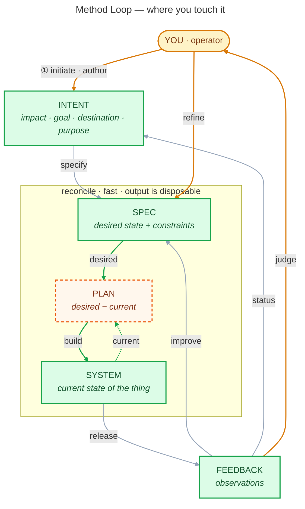

# The Method Loop

How I work, as a single reconciling loop. I author **intent**; everything downstream
is a continuous reconciliation of *desired state* against *current state* until the two
match, then I judge the result and the loop turns again.

## Reading the loop

**Kept vs ephemeral.** Four artifacts are durable and worth maintaining — `INTENT`,
`SPEC`, `SYSTEM`, `FEEDBACK` (green). `PLAN` (orange, dashed) is disposable: it's just
`desired − current` recomputed whenever either side moves, so it's never edited directly
or stored for long.

**The reconcile core.** `SPEC` (desired state + constraints) and `SYSTEM` (current state)
are continuously diffed into `PLAN`, which is built back into `SYSTEM`. This runs fast and
often; the output of each pass is throwaway.

**Operator touchpoints.** I only ever touch three places: I **author** `INTENT` (①), I
**refine** `SPEC`, and I **judge** `FEEDBACK`. Everything else reconciles on its own.

**Two return edges.** `FEEDBACK → SPEC` *improves* the desired state from what was
observed; `FEEDBACK → INTENT` reports *status* back up, so intent stays honest about
what's actually happening.

## Where each stage lives in this repo

This repo currently materialises the **INTENT** stage only. The rest are documented
placeholders the loop will grow into — they live per-project (in the repos of the things
I build), not here.

| Stage | Artifact | In this repo |
| --- | --- | --- |
| **INTENT** | impact · goal · destination · purpose | `claude/intent.md` (the inbox) → `claude/okrs/active/` (the prioritised suite) |
| SPEC | desired state + constraints | _future_ |
| PLAN | desired − current (ephemeral) | _future; per-project, never stored_ |
| SYSTEM | current state of the thing | the things I build (per-project repos) |
| FEEDBACK | observations · status | _future_ |

## The INTENT stage today

Intent is handled in two moves, both driven by the `/intent` skill:

1. **Discover** — surface what I actually intend (impact, goal, destination, purpose) and
   capture each as raw intent in `claude/intent.md`. No OKR shape is forced yet.
2. **Prioritise** — rank the inbox, pick a small current suite, and promote the top
   intents into OKRs (via the `/okr` skill) under `claude/okrs/active/`. Each active OKR
   is injected into every Claude Code session by the `SessionStart` hook.

So the path is: **`/intent` discover → `claude/intent.md` → `/intent` prioritise →
`/okr` → `claude/okrs/active/` → injected every session.**
